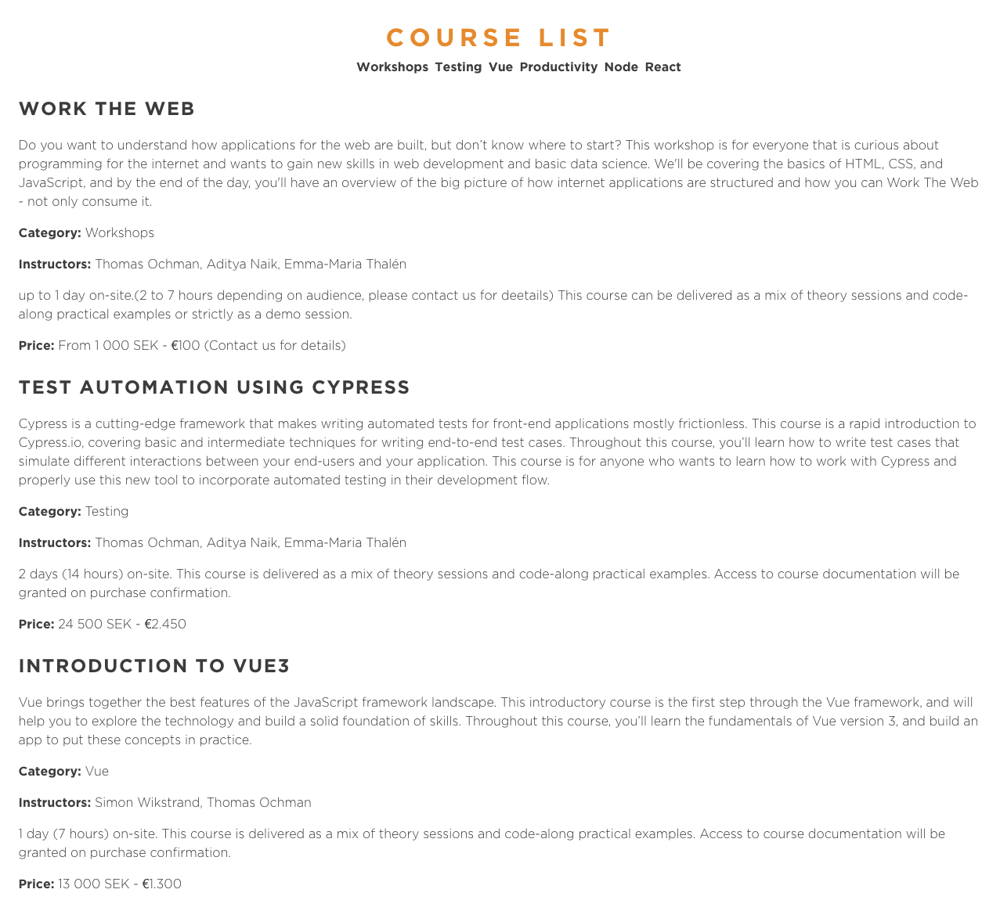

## The Rewrite Challenge
This is a simulation of a real-life task that you might (or might not) experience as a professional developer.

You have applied for a job at a education firm. They want to assess your skills before they present you with an offer. For that reason, they want you to participate in a stress test, where you will be writing code under supervision..

You have been presented with a task to rewrite a piece of software. It is a Course Catalog with filtering functionality. Today, the code is written in pure JavaScript. Your future employer wishes to have the exact same functionality and the exact same look and feel of the UI, but to have this catalog  presented to them as a ReactJS application.

Also, they have recently started to make use of CypressIO, and would like you to add acceptance tests to your submission.

This is a variant of a legacy challenge. You need to carefully examine the code, what each function do, and how it's being used. It is only when you truly understand the current implementation, that you'll be able to come up with a solution in React that will be your ticket in to the organization where you desire to work.

There is a folder called **react-app** where you have a basic scaffold of an React Application with CypressIO configured, where you should implement your solution. 

**For extra credit, you might want to consider implementing a feature that displays ALL the courses again. Once the user has started to use the filtering functionality, there is currently no other way for him/her to see all the courses again (accept for reloading the page of course).**

#### Good Luck!

